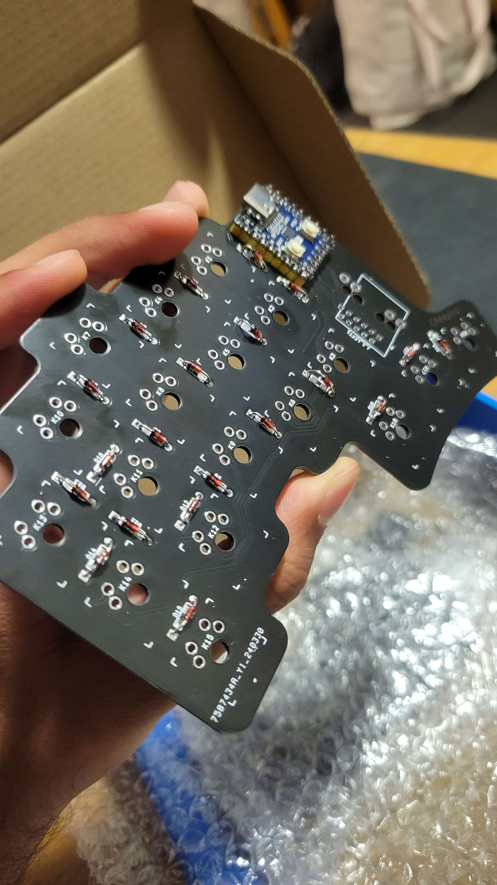
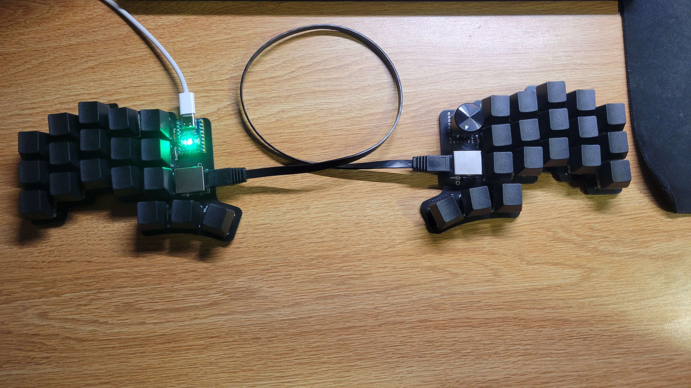
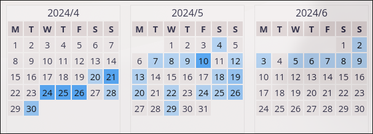
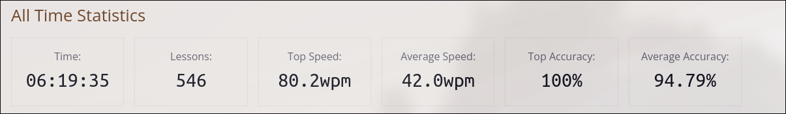
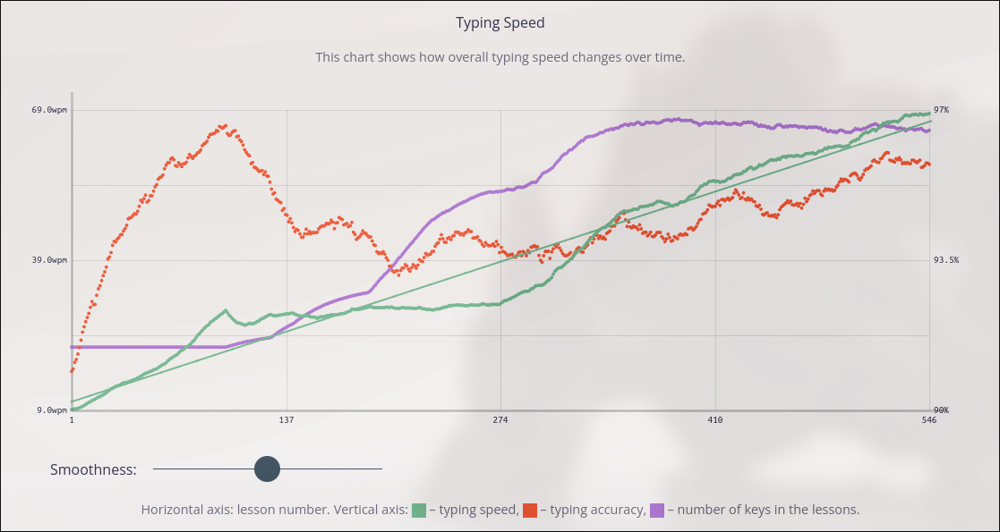

# The Inspiration

    
**The Primeagen.**

For those of you who dont know the popular technology creator, The Primeagen
is a popular twitch streamer, and ex-Senior-Netflix developer who adores his decade
old split keyboard, [The Kinesis 360](https://kinesis-ergo.com/keyboards/advantage360/).

He's claimed that using a split keyboard helped him overcome the 
[RSI](http://google.com/search?q=repetitive%20strain%20injury) injuries he's 
suffered from typing daily for a few years in his career. Hearing this made 
me very intrigued, because I want to become a developer in the future as well, 
and would hate to suffer through the same injuries in the near future.

Also, c'mon, it just looks downright cool.

# The Board

    
 **The Board.** 

While there are many fully built spilt keyboards for sale, they are typically 
very expensive. Something that, as a broke college student, I just don't have 
the funds for. Que in ...

## The Cheapino

An open source project that servers to make custom split keyboards approachable 
and affordable, found [here](https://github.com/tompi/cheapino).

In total for my build it came out to 40–50 dollars, much less than the typical 
100 - 200 dollars that a typical split keyboard would cost. It does mean that
you'll have to buy all the parts yourself, assemble it yourself, and configure
it yourself. **Truly custom keyboard.**

# The Assembly

    
 **Assembling and Soldering the Board** 

After sourcing the parts from Alibaba and JLCPCB, it was time to start soldering.
It was my first time soldering but with the help of a friend we went to 
slug works, where we could get the proper soldering equipment. The picture above
was my very first time soldering and I would say I did a pretty good job.

After soldering the diodes on the board, it was time to solder the Cherry 
MX Brown switches on, and I admit they did go on a bit crooked.

# The Final Product

     
 **The Final Product** 

If you look closely, you can see how some of the switches are rotated but for the 
most part, it came out pretty good. There's an Ethernet cable connecting the split 
together, and a USB c wire runs form the controller to whatever device you want
to use it with.

# Layout

Now you may be thinking, how can you replace a normal keyboard with this? It only
has 36 keys, so what hope is there to emulate the 104 keys on a normal keyboard ?

### [Miryoku](https://github.com/manna-harbour/miryoku)

A layout that utilizes all 36 keys for their maximum potential. There are two key features that make this possible.

#### Layers
If you look at the thumb keys, you will see text near the bottom 
[ Media, Nav, Mouse, Sym, Num, Fun ]. Upon holding down one of these keys, the 
opposing board turns into whatever color of the thumb key held down. For example
if I held down the Num thumb key, my left board turns into the blue font, the 
numbers. The board resets once I lift my thumb. With these layers my board can 
emulate all the 104 keys on a normal keyboard, and there's enough room to emulate 
mouse movements as well.

#### Homerow Mod Switches
If you take a close look at the home row keys, you'll see the subtext
super, alt, ctrl, and shift on them. If I hold down that respective key, it will act as a prefix to the next key I press, or will execute as its own if I 
raise my finger. For example if I want to do the combination 
<kbd>SHIFT</kbd> + <kbd>B</kbd> to produce a capital b, I hold down the n key 
on my right board, press <kbd>B</kbd> on my left, and then let go on my right.

### Colemak DH

     
 **Colemak DH Layout** 

The keen among you would see that the keys are not in a QWERTY layout, and many
keys are in different places. Once I finished my board, I had to restart learning how to type.
At first, it was quite hard, and believe it or not, my fingers genuinely started feeling sore
after a few minutes of typing. And remember that a few minutes of typing meant around
30 words. On QWERTY I was typing at more than 100 words per minute all day long, and now
I'm lucky if I can type 10 wpm for a few minutes without my fingers going partially
numb.

### How did I get better?

[**Keybr.com**](https://www.keybr.com/), a website that has options for a 
variety of layouts and teaches you from the bottom up. I hopped on it 
as soon as I flashed my keyboard with Miryoku, and wow was it hard. 
A single lesson (around 20 words) would take me at least a minute, and 
would be riddled with mistakes. So I kept at it for a few months.

    
 **Calendar of practice** 

    
 **All Time Stats** 

    
 **Typing Speed and Accuracy as a Graph** 

### My Thoughts on the Transition
There are plenty of articles and videos online saying that changing keyboard
layouts is bad, or that one layout is better than the other, or maybe 
that some layout is going to make you type insanely faster. As for my thoughts, 
it really **doesn't matter**. Type on whatever feels comfortable to you, and if you
want to change something up, then go for it. Changing layouts is definitely 
not going to make you faster, and It's going to take you at least a week, and 
a reasonable amount of determination to come back to a reasonable typing speed.

# Conclusion
Thank you for taking the time to read my article and I hope you were able to get
something useful out of it. 
