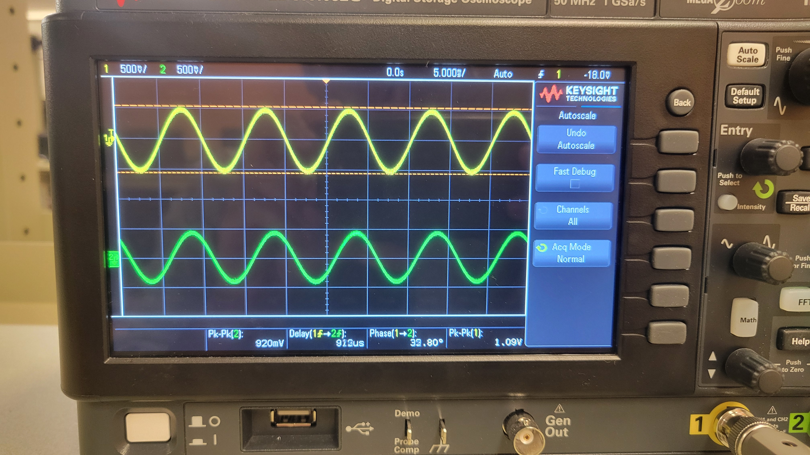
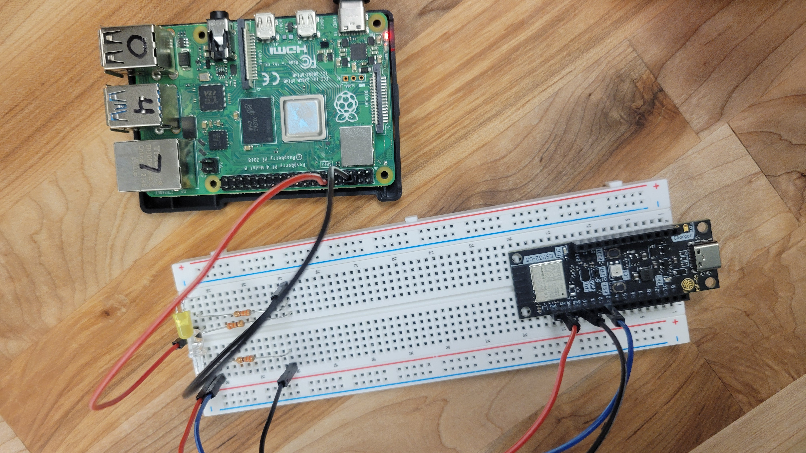
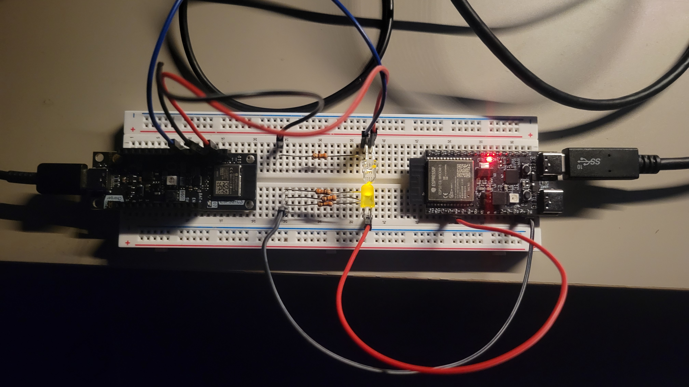

# The Problem Defenition

Originally this started as a lab assignment for my CSE 121
(Embedded System Desgin) class.  We have a Raspberry Pi
computer and a ESP32c3 embedded device board, and the task
is to send data from the Pi to the ESP32 using light! The Pi
converts the text to morse code, and proceedes to modulate
the LED; the ESP32 is hooked up to a light sensor, and
needs to convert that data back into the original message.


### How are we supposed to do that!?

you might be asking...

Lets define some things that we need to understand first before we get into the specifications.

1. Raspberry Pi - Mini Computer

  
      <center>**Raspberry Pi**</center>

  The raspberry pi is a tiny (palm-sized) computer that do a lot of
  things that regular computers can do. It's really a feat of modern
  engineering purely based off how much functionality is crammed into
  this thing -- like It can drive 2 seperate displays! How crazy is that!
  We will be using this as the device that makes the led blink.

2. ESP32 - Even Minier Computer

  
      <center>**ESP32c3 Board**</center>

  The ESP32 is a computer the length of an adult finger, and
  its honestly suprising how feature-rich it is.
  It has bluetooth and Wifi capability, so you can
  talk to pretty much any device around you, as well as a bunch
  of different peripherals. We are going to be using this as our
  receiver device.
    
3. GPIO - General Purpose Input Output

  GPIO pins are litte metal pins that stick out of both
  boards and act as, well its kind of in the name, General
  Purpose Input / Output, for the board.  They can take in
  electrical signals, and expose them to the software we can
  write on the board!


  
      <center>**GPIO pins on a Raspberry Pi**</center>

4. Photodiode - Light Sensor
  

  Photodiode's are little guys that allow current to pass
  through when they are hit with light! They have this
  property due to a special kind of semiconductor, whose
  conductivity dependson the amount of light hitting it.
  Basically they are light sensors.


5. ADC - Analog to Digital Converter

  
      <center>**ADC in Action!**</center>

  To understand what an ADC is, we need to first understand what an analog signal is.
  To put it simply, an analog signal is any "value" (of some physical thing) that vary's over time.
  For example if you had a microphone that measures how loud a room is, its outputting an analog signal because
  the decibels in the room are varying over time! In computer land, analog signals usually refer to some
  voltage input (for now just assume that voltage = strength of electricity), that vary over time. When you graph
  out an analog signal, or measure it with an oscilloscope, you can see something like this, which shows an input signal varying over time.

  
      <center> **An analog signal on an oscilloscope.** </center>

  Computers however process data in 1's and 0's. Meaning if you provide a input to
  the computer of 3.3 volts, it has no idea how to understand that value.
  Computers however love when things toggle from off to on, or vice versa.  This
  means that for our computer to understand our analog signal, we need to take an
  analog value and convert it to a series of 0's and 1's, respectively meaning off
  and on.

  An example would be like, if an analog value we read is 10 volts, we can convert
  that measurement to the signal `1010`, which is 10 in binary! Now when our
  computer sees that signal, it can figure out that our analog measurement was 10
  volts. The ADC is simply a piece of hardware that does this conversion for us
  automatically, so when we write software for the computer, we can understand
  the signals it's picking up.

  If our signal is varying, like the picture above, the ADC performs this
  conversion continuously! You can ask the adc to "sample" (look at) the analog
  signal at 1000 Hz (1000 times a second), and it will simply measure what value
  it sees every 1/1000'th of a second and converts that to a binary number.

  Our ESP32 comes with one of these, which comes in super handly later on!


## The Initial Setup

  
      <center> **Pi hooked LED, Photodiode hooked up to ESP32** </center>


I won't get too into the weeds, but I have the LED connected
to the a GPIO pin on the PI, with the diode right next to
the LED connected to a GIPO pin on the ESP32. The blue wire
going into the ESP32 connects to the "output" of the photo
diode, and is what we are going to feed into the ADC.

#### But Wait...

How exactly are we supposed to send messages using an led?


## The Protocol

The problem statement mandates the use of morse code for sending messages, so lets have a quick
refresher on that.

### Morse Code


Morse code is a communication protocol that uses dots and dashes to represent different
characters. I think learning by example is the best, so let's try encoding the phrase "code".

- C = `-.-.`
- O = `---`
- D = `-..`
- E = `.`

putting it all together, we get `-.-.|---|-..|.` where `|` is the delimiter between characters.
In the official morse code protocol, it is represented as waiting for 3 time units (where a unit is the duration of a dot).

Now lets try converting that string of morse code into LED blinks.

Using a 0 for the led being off, and a 1 for the led being on, 
we can use the following representation for representing different pieces of the morse code.


- Dot = `10`
- Dash = `110`
- Character Break = `000000`

Note that dots and dashes are terminated by a `0` so we can
distinguish a Dot from a Dash.

If a dot = `1`, and a Dash =
`11`, the sequence `1111` would be ambiguous. Would it be
translated as `....` or `.-.` or maybe even `--`? Due to
this problem, dots and dashes end with a `0`.

Now the
seqence `10110` can only be interpreted one way:
`.-`.


Using this patten, the sequence `-.-.|---|-..|.` becomes the series

`110 10 110 10 000000 110 110 110 000000 110 10 10 000000 10`

Keep in mind that each 1 and 0 is being held for a consistent time `x`, so
the longer a string is, the longer it takes to transmit.

Looking at the sequence, I couldn't help but feel a bit annoyed that character breaks
lead to me having the led off for a whole 6 units!! So I made the following optimization...

- Character Break = `0`

Now the sequence becomes

`110 10 110 10 0 110 110 110 0 110 10 10 0 10`

Much better!

## The Naive Transmitter
Now we just have to program the Raspberry Pi to take in a message, and
convert it to morse code, convert that morse code to led blinks, and then
blink the LED accordingly. For the less technically savvy feel free to skim the
rest of this post, but if you wan't to get into the weeds, then follow along!


### Representing the Morse Table

The easiest / most performant way I figured to represent the Morse Table
was an array of morse sequences, that can be indexed by the conversion
of each ascii character to its integer form.

```rust
#[derive(Debug)]
/// Enum to represent a Dot or Dash
enum MorseBit {
    Dot,
    Dash,
}

const MORSE_TABLE: [&[MorseBit]; 128] = {
    let mut table = [&[] as &[MorseBit]; 128];
    use MorseBit::*;

    table[b'a' as usize] = &[Dot, Dash];
    table[b'b' as usize] = &[Dash, Dot, Dot, Dot];
    table[b'c' as usize] = &[Dash, Dot, Dash, Dot];
    table[b'd' as usize] = &[Dash, Dot, Dot];
    ...

    table
}
```

the **b'a'** syntax returns the binary value of the character **a**, and then we set
that index in the array to be equal to the sequence **.-**.

This allows us an easy way to turn any ascii character into its morse code representation

```rust
let a_as_morse = MORSE_TABLE[b'a'];
```

So now for every message we can split it into its characters, look up what it is in the table,
and then make the led blink like so.


```rust 
for char in message.chars() {
    let Some(mbits): Option<&&[MorseBit]> = MORSE_TABLE.get(char as usize) else {
        info!("Invalid character! {char}");
    };

    for m_bit in *mbits {
        match m_bit {
            MorseBit::Dot => {
                led_pin.set_high();
                sleep(time_step);
                led_pin.set_low();
                sleep(time_step);
            }
            MorseBit::Dash => {
                led_pin.set_high();
                sleep(time_step);
                sleep(time_step);
                led_pin.set_low();
                sleep(time_step);
            }
        }
    }

    // after we are done sending the character, need to send the character break message
    led_pin.set_low();
    sleep(time_step);
}
```

Note that the `time_step` is a variable length duration that represents how long an "ON" and "OFF" are;
the only important thing for now is to make the `time_step` the same on the receiver and
transmitter so they can communicate in sync.

## Receiver

Now all the receiver has to do is read the light sensor data out of the ADC and
convert it back into Morse Code. Then you can take that Morse Code and turn it back
into text!.

### ADC Measurement

Remember earlier that the ADC gives you a digital value of whichever signal it picked up,
so when you read data from it, it just spits out a number. There are more specific details
you can get into here, like calibrating the ADC output so it reports accurate voltages, but
for our usecase we can treat the number its spitting out as how "strong" the led was
, at that point in time.

Now we need to do some manual tuning to clamp the value we are reading, i.e

saying that the LED is On if the value we read is above 100,
and Low otherwise.

Now we can store the value we read at each time-step and convert that to dots/dashes/character break
using our pattern from earlier.

- Dot = `10`
- Dash = `110`
- Character Break = `0`


After converting them into dots and dashes we do the following

1. Split the sequence by character breaks.

2. For each sequence in between the breaks, we look up that sequence inside an inverse morse table.

3. If a letter exists for that sequence we print it out.

Awesome, we can now transmit information using morse code!

*Drum Roll.....*


Well that was underwhelmning.

## Dissapointment

While the work we have done so far is enough to finish the assignment we were assigned, I'm not satisfied...

1. Receiver in C

  I admit there might be some skill issues going on, but
  waiting 20 seconds everytime I wanted to try a change on
  the receiver was mentally taxing.  Additionally I didn't
  have an LSP set up for embedded C development,or other
  development tools I use regulary, which was a major
  bummer.

  
2. Raw Speed

  LED's can turn On and Off in nano seconds. Orders of magnitude faster than our speed.
  Secondly the ADC can run at a max speed of 85,000 Hz. We are nowhere close to the
  physical limit of our hardware.


3. Raspberry Pi transmitter

  I was worried that when I try to go faster on the pi, the timings could get messed up
  due to operating system interrupts or some other shenanigans that could happen, since
  it is a full on computer after all. I wanted a more reliable driver for the transmitter,
  which would allow me to go faster fearlessly.

  

## Stage 2


My solutions to each of the pain points above are as follows.

1. Write the Receiver in Rust too

I found [rust bindings](https://github.com/esp-rs/esp-idf-svc) to the ESP-IDF-SDK, which is the C software development kit,
so that opens this door! The setup was honestly much easier, and the flashing took less time too! 


2. Use the continuous ADC driver, and run it at full speed.

Previously I was asking the ADC for a measurement when I was ready to measure it.
If i wanted to measure every half second, I would ask once, wait 500 milliseconds, and then ask again.
Instead the ADC supports another way of operation, called continuous mode.
For this you configure the ADC to measure at, say 1000 Hz, and you call the read function in a loop.
Now it puts the data it reads in a buffer and you can do whatever you want with it, with the guarantee that it was sampled at
the Hertz you wanted.

```rust
let config = AdcContConfig::default().sample_freq(Hertz::from(1000));
// this sets the "sensitivity" of the ADC
let adc_1_channel_0 = Attenuated::db11(peripherals.pins.gpio2);
let mut adc = AdcContDriver::new(peripherals.adc1, &config, adc_1_channel_0)?;

adc.start()?;
// array to store samples, 100 max number of samples
let mut samples = [AdcMeasurement::default(); 100];
loop {
// num read is the amount of valid samples inside the samples buffer
    let Ok(num_read) = adc.read(&mut samples, 10) else {
        // its ok if we cant read from the adc
        continue;
    };

    // do whatever you want
}
```
  <center>Continuous ADC Driver Example</center>


A niche optimization we can do here is set our timestep to equal
the hertz the ADC is sampling at.

i.e if we set our time step to 1 millisecond, we can
sample at 1000Hz, which would take a measurement
every 1 millisecond! That way we dont have to be
waiting for timesteps on the receiver, and instead
process data as it comes in with the invariant that
its measured at the proper timestep.

3. Use another microcontroller

I had bought a personal ESP32 for a project, but it was lying around collecting dust, so I figured
it would make for a perfect transmitter. The code I flash onto it would be the only thing running,
meaning I have far more control over how precise the LED timings are.


## The Beginning of the Final Strech


    <center> **Final Setup** </center>

I have the same setup for the receiver, and the new ESP32 acting as the transmitter for the LED.

Then I performed this massive rewrite of the receiver and transmitter, using a common
crate to abstract all the morse-code specific logic away. Additionally, through lots
of trail and error, I made a few system level changes to support the high-speed
domain we are close to entering.

### Start Sequence

After running the system, I ran into a really silly issue. Since I've set the `0` value from the sensor to be `CharBreak`, if there isnt any data
being transmitted, meaning the light is off, the receiver just picks up a bunch of character breaks. My solution to this is setting up a Start Sequence,
basically a pattern the receiver listens for, and once it sees it, it starts the parsing logic.


```rust
//NOTE: I found this sequence to work fairly well through experimental testing.
pub const START_SEQUENCE: [Bit; 10] = [
    Bit::Hi,
    Bit::Hi,
    Bit::Hi,
    Bit::Hi,
    Bit::Hi,
    Bit::Lo,
    Bit::Lo,
    Bit::Lo,
    Bit::Hi,
    Bit::Hi,
];
```

And the receiver logic is implemented as a queue that gets
pushed with every bit value we see, and then we see if the
values in the queue match the pattern; if so, we start the
listening logic.


```rust
let start_queue = self.start_queue.as_mut().unwrap();
if start_queue.len() == START_SEQUENCE.len() {
    start_queue.pop_front();
    start_queue.push_back(bit);
    let pattern = start_queue.make_contiguous();
    if pattern == START_SEQUENCE {
        /// start the listening logic
        ...
    }
} else {
    start_queue.push_back(bit);
}
```


This really helps the success rate of message transmissions
because we are only processing bits that we know to be part
of a valid message.

### Timing Calibration

Earlier I talked about using the ADC sample rate as our time
step, and modulating the LED at that time step, and booom
everything should be fine right?!

#### No...

In reality the timing of each LED on and OFF is not exact, and usually higher than the delay we specify, especially if our code looks like this

```rust
for bit in &data_packet {
    match bit {
        morse::Bit::Hi => led.set_high(),
        morse::Bit::Lo => led.set_low(),
    }
    delay.delay_micros(morse::TIME_STEP_MICROS as u32);
}
```

Theres a bit of overhead, albeit consistent, that makes it so
the real timestep is ging to be the `real_time_step = TIME_STEP_MICROS + x`
where `x` is how long that overhead takes to run.

The only way to find that `x` is to take measurements! So I have the following contraption set up.
```rust
info!("Calibrating...");
for _ in 1..1000 {
    // take a snapshot of the time before the transmission
    let char_start = Instant::now();

    // transmit the packet
    for bit in &data_packet {
        hold_bit_for_time_step(&mut led, bit, &delay);
    }

    // store the amount of elapsed microseconds from 
    let elapsed_char_micros = char_start.elapsed().as_micros();

    // number of bits in the data packet
    let char_bits = data_packet.len();

    // the expected time should just be the number of bits times the set time step
    let expected_time = char_bits as usize * TIME_STEP_MICROS as usize;

    //  The optimal frequency for this run is the following formula
    // (number of microseconds in a second) / (((the difference in actual vs ideal transmission times) / (total number of bits sent)) + ideal transmissoin time)
    //  It looks like a complicated formula but just trust me that
    //  the result is going to be the ideal receiver frequency
    //  that takes the `x` delay into account
    let optimal_receiver_freq = 1e6
        / (((elapsed_char_micros - expected_time as u64) as f64 / char_bits as f64)
            + TIME_STEP_MICROS as f64);


    // since the optimal frequency depends on the time it takes
    // for each message to be sent, we would like an averaged
    // value, so the remaining code is  the running average
    // formula applied to the optimal receiver frequency
    transmits += 1;
    running_avg_recv_freq = running_avg_recv_freq
        + ((optimal_receiver_freq - running_avg_recv_freq) / transmits as f64);
}
info!("optimal recv freq :  {} Hz", running_avg_recv_freq);
```

Running this calibration code gives us a result that looks like this:


``` 
[INFO] Calibrating... (tx src/bin/main.rs:52)
[INFO] optimal recv freq :  83315.16620551319 Hz (tx src/bin/main.rs:79)
```
Note that the optimal receiver frequency does change just a tiny bit depending on the message length / its morse encoding, even if
the ideal frequency is the same.

Now all we do is set the receiver to the optimal receiver frequency, and we should get perfect sampling!

### Serialization Optimization

While the morse serialization pattern I came up with originally was good enough, I felt like I could get even more out of it.


I wanted to revisit our original encoding scheme, to see if there was some more performance we could squeeze out. As a reminder, this was our encoding scheme for morse code:


- Dot = `10`
- Dash = `110`
- Character Break = `0`

But to test how well our encoding performs, we need a test message. Since I didnt feel like doing an arduous amound of testing, I figured a good test would be a string that contains
all letters of the alphabet, with multiples of each letter corresponding to its usage in the english language. It ends up looking like this: 

```
EEEEEEEEEEEEE
TTTTTTTTTT
AAAAAAAAA
OOOOOOOOO
IIIIIIII
NNNNNNN
SSSSSS
HHHHHH
RRRRRR
DDDDD
LLLLL
CCCC
UUUU
MMMM
WWW
FFF
GGG
YYY
PPP
BB
VV
KK
JJ
X
Q
Z
```

and as a message it would be 
```
EEEEEEEEEEEEETTTTTTTTTTAAAAAAAAAOOOOOOOOOIIIIIIIINNNNNNNSSSSSSHHHHHHRRRRRRDDDDDDLLLLLCCCCUUUUMMMMWWWFFFGGGYYYPPPBBVVKKJJXQZ
```

Now we have a decent "average" message for testing encoding schemes.


1. The Original
- Dot = `10`
- Dash = `110`
- Character Break = `0`

```
[INFO ] optimal recv freq :  83273.31652862801 Hz (tx src/bin/main.rs:125)
[INFO ] chars per second  :  11073.100468131077 (tx src/bin/main.rs:126)
[INFO ] bits per second   :  83229.4819298558 (tx src/bin/main.rs:127)
```

This is the stats for our naive "optimized" serialzation of morse code, and below are the two other "sensible" combinations.

2. Encoding 2
- Dot = `0`
- Dash = `10`
- Character Break = `110`

```
[INFO ] optimal recv freq :  83267.48320821811 Hz (tx src/bin/main.rs:125)
[INFO ] chars per second  :  12149.348083761359 (tx src/bin/main.rs:126)
[INFO ] bits per second   :  83227.63196409406 (tx src/bin/main.rs:127)
```

This encoding would work well if, on average, each character has a dash, which is fairly common in morse code. It gives us a ~1000 char/sec boost to our speed, so thats pretty cool!


3. Encoding 3
- Dot = `0`
- Dash = `110`
- Character Break = `10`

```
[INFO ] optimal recv freq :  83268.8588007737 Hz (tx src/bin/main.rs:125)
[INFO ] chars per second  :  11895.551257253384 (tx src/bin/main.rs:126)
[INFO ] bits per second   :  83229.81366459628 (tx src/bin/main.rs:127)
```

The third encoding is ~200 char/s slower than the second one.
However, if you have more character breaks than total dashes,
(hint: foreshadowing) this will give you a higher top speed.

For the following runs I'll either be using encoding 2 or 3.

### Data Collection

I really wanted a nice way to measure how well our receiver is reading the message. I decided to add some data collection and logging
that informs me how well the receivers picked up message compares to the message we are sending from the transmitter.


```rust
match parser.message() {
    Ok(msg) => {
        // we read succesfully!
        successful_reads += 1;
        // this is the message the transmitter is sending
        let perf_msg = morse::MSG.to_lowercase();
        if msg == perf_msg {
            // we read perfectly!
            perfect_reads += 1;
        }

        // lets crunch some numbers here
        let read_rate: f32 = (successful_reads as f32 / attempts as f32) * 100.0;
        let perfect_rate: f32 = (perfect_reads as f32 / attempts as f32) * 100.0;

        info!("Message          : {msg}");
        info!("Read accuracy    : {read_rate}%");
        info!("Perfect accuracy : {perfect_rate}%");
        info!("Attempts         : {attempts}");
        println!("\n\n")
    }
    Err(e) => {
        error!("failed to parse message! {e:?}");
    }
}

```

## The Final Strech

Okay new system ready to go, now all we have to do is run it.

First lets set our message...
```rust
pub const MSG: &str = "suri.codes";
```

Configure the time step... 

(The reason we set the time step to 11 micros is becase a timestep of 10 would result in our optimal recv frequency being above the rated frequency of the ADC on the ESP32c3)
```rust
pub const TIME_STEP_MICROS: u64 = 11;
```

and begin the optimal frequency calculation on the transmitter...
```
[INFO ] Calibrating... (tx src/bin/main.rs:52)
[INFO ] optimal recv freq :  83254.81240497294 Hz (tx src/bin/main.rs:79)
[INFO ] Press boot button to start transmitting message! (tx src/bin/main.rs:80)  
```

Now we set the ADC sampling frequency on the receiver...
```rust
const SAMPLE_HERTZ: u64 = 83255;
```

And now lets have this run for a while...

<INSERT 5 MINUTES WHILE I SNACK>

and viola!


Our transmitter logs are looking like
```
[INFO ] sending start sequence! (tx src/bin/main.rs:92)
[INFO ] Message           :  suri.codes (tx src/bin/main.rs:123)
[INFO ] transmission time :  925 micros (tx src/bin/main.rs:124)
[INFO ] optimal recv freq :  83280.63678143303 Hz (tx src/bin/main.rs:125)
[INFO ] chars per second  :  10810.81081081081 (tx src/bin/main.rs:126)
[INFO ] bits per second   :  83173.99617590822 (tx src/bin/main.rs:127)
[INFO ] total msg bits    :  77 (tx src/bin/main.rs:128)
[INFO ] total bits        :  87 (tx src/bin/main.rs:129)
```

While the receiver logs look like

```
I (526366) rx: Message          : suri.codes
I (526366) rx: Read accuracy    : 97.78262%
I (526366) rx: Perfect accuracy : 97.52817%
I (526376) rx: Attempts         : 2751
```


We are transmitting at **10,810 char/s** (per message), with a
perfect read accuracy of **97.53%!** It's not usable for any real
data transmission workloads, but for a hobbyist project that
started off as a lab assignment, thats pretty cool!


**But can we go faster?**

_Cue the music..._

## Gas Gas Gas

<iframe width="600" height="400" src="https://www.youtube.com/embed/dzod0j4E-rQ?start=77" title="Manuel - Gas Gas Gas (Eurobeat)" frameborder="0" allow="accelerometer; autoplay; clipboard-write; encrypted-media; gyroscope; picture-in-picture; web-share" referrerpolicy="strict-origin-when-cross-origin" allowfullscreen></iframe>

Alright lets lock in.

The only hard limit we have is the ADC sampling frequency of ~85,000 Hz. Meaning we can only ever send around ~85,000 bits per second.

Seeing from the logs earlier we see that we are already sending...

```
[INFO ] bits per second   :  83173.99617590822 (tx src/bin/main.rs:127
```

Meaning we have to cram the maximum amount of characters into bits. Logically this means we should see how many letters in morse code rely on a single dash or dot.

Our two options are: **E**: Dot or **T**: Dash

Rememer that our encoding represents a Dot as a single **0** bit, so I'll be choosing E as our ideal letter.

Also we can posit that Encoding 3 is faster for this usecase since there are no dashes.

Finally, Lets try it!

```
[INFO ] Message           :  e (tx src/bin/main.rs:123)
[INFO ] transmission time :  61 micros (tx src/bin/main.rs:124)
[INFO ] optimal recv freq :  82001.04240551664 Hz (tx src/bin/main.rs:125)
[INFO ] chars per second  :  16393.44262295082 (tx src/bin/main.rs:126)
[INFO ] bits per second   :  81967.2131147541 (tx src/bin/main.rs:127)
[INFO ] total msg bits    :  5 (tx src/bin/main.rs:128)
[INFO ] total bits        :  15 (tx src/bin/main.rs:129)
```
Good but it's still not the fastest we can go.

It's because the real message I was sending was `E<MSG_BREAK>` -> `01110`

I needed some way to reduce the price I was paying for the `<MSG_BREAK>`. The easiest solution to this would be
to send many more characters per message to amortize the cost of the single `<MSG_BREAK>` sequence at the end.

In the end my final string ends up looking like (you can add more e's if you want) 
**eeeeeeeeeeeeeeeeeeeeeeeeeeeeeeeeeeeeeeeeeeeeeeeeeeeeeeeeeee**

It's not really meaningful information, but it sure does go fast.

```
[INFO ] Message           :  eeeeeeeeeeeeeeeeeeeeeeeeeeeeeeeeeeeeeeeeeeeeeeeeeeeeeeeeeee (tx src/bin/main.rs:123)
[INFO ] transmission time :  2149 micros (tx src/bin/main.rs:124)
[INFO ] optimal recv freq :  83297.23094204796 Hz (tx src/bin/main.rs:125)
[INFO ] chars per second  :  27454.63006049325 (tx src/bin/main.rs:126)
[INFO ] bits per second   :  83296.60643455267 (tx src/bin/main.rs:127)
[INFO ] total msg bits    :  179 (tx src/bin/main.rs:128)
[INFO ] total bits        :  189 (tx src/bin/main.rs:129)
[INFO ]
```

```
I (240916) rx: Message          : eeeeeeeeeeeeeeeeeeeeeeeeeeeeeeeeeeeeeeeeeeeeeeeeeeeeeeeeeee
I (240916) rx: Read accuracy    : 97.3582%
I (240926) rx: Perfect accuracy : 96.0373%
I (240926) rx: Attempts         : 1287
```


**27,454 Characters per second, Perfect Accurasy: 96%.**


## Cheese


One way to even faster would just be to encode the `MSG_BREAK`
as `1`, so when you send an `e`, it gets received as `01`, and
then youre only transmitting 2 bits for the entire message.
Our bit speed is ~83,000 bits per second, so you could
theoretically send ~41,500 characters per second, but when you
do that, it would be impossible to encode a Dash without
ambiguity, so you wouldn't be able to transmit any other
message. For that reason, I don't count this.


# Fin

If you made it this far, thank you for following me on this
journey! The code for this endeavor can be found
[here](https://github.com/suri-codes/Gas) if you're interested.
If you have any questions feel free to reach out!


<!-- interesting forum talking about gpio access speeds on the raspberry pi -->
<!-- https://forums.raspberrypi.com/viewtopic.php?t=9114 -->


